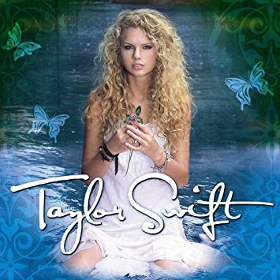
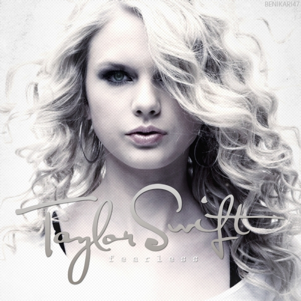
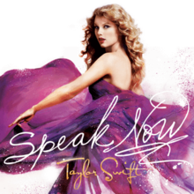
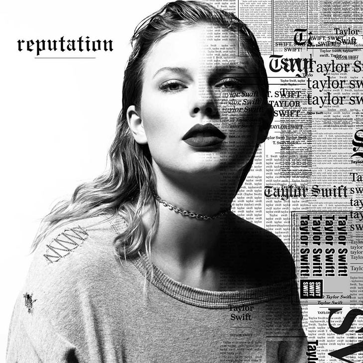

<html lang="en">

<head>

  <meta charset="UTF-8" />
  <link rel='icon' href='images/favicon.cc' type='images/favicon.ico' />
  <title>Taylor Swift Tribute Page</title>
  <link rel="stylesheet" type="text/css" href="ts_stylesheet.css">

</head>

<body>

  

    <header>
      <h1>Taylor Swift: A Tribute Page</h1>
    </header>

    <nav>
      <h2>Navigation</h2>
      <ul>
        <li><a href="Bio.html">Bio</a></li>
        <li><a href="Members">Members</a></li>
        <li><a href="Favorite Song">Favorite Song</a></li>
      </ul>
    </nav>

    <h2>Bio</h2>

    

      Taylor Alison Swift (born December 13, 1989) is an American singer-songwriter. She is known for narrative songs
      about her personal life, which have received widespread media coverage. Born and raised in Reading, Pennsylvania,
      Swift moved to Nashville, Tennessee at the age of 14 to pursue a career in country music. She signed with label
      Big Machine Records and became the youngest artist signed by the Sony/ATV Music publishing house. Her 2006
      eponymous
      debut album was the longest-charting album of the 2000s in the U.S., where it peaked at number five. The album's
      third single, "Our Song", made her the youngest person to single-handedly write and perform a number-one song on
      the Hot Country Songs chart. Swift's second album, Fearless, was released in 2008. Buoyed by the success of pop
      crossover singles "Love Story" and "You Belong with Me", Fearless became the best-selling album of 2009 in the
      U.S. The album won four Grammy Awards, and Swift became the youngest Album of the Year winner.
    

    

      Swift was the sole writer of her 2010 album Speak Now. It debuted at number one in the U.S., and the single "Mean"
      won two Grammy Awards. Her fourth album, Red (2012), yielded the successful singles "We Are Never Ever Getting
      Back Together" and "I Knew You Were Trouble". For her fifth album, the pop-focused 1989 (2014), she received three
      Grammys and became the first woman and fifth act overall to win Album of the Year twice. Its singles "Shake It
      Off", "Blank Space", and "Bad Blood" reached number one in the U.S., Australia, and Canada. The first two made
      Swift the
      first woman in the Billboard Hot 100's history to succeed herself at the top spot. Her sixth album, Reputation
      (2017), and its lead single, "Look What You Made Me Do", topped the UK and U.S. charts; with the release of
      Reputation, Swift became the first act to have four albums sell one million copies within one week in the U.S. Her
      seventh album, Lover (2019), spawned two U.S. number-two singles, "Me!" and "You Need to Calm Down".
    

    

      Having sold more than 50 million albums—including 32 million in the U.S.—and 150 million singles, Swift is one of
      the best-selling music artists of all time. As a songwriter, she has received awards from the Nashville
      Songwriters Association and the Songwriters Hall of Fame, and was included in Rolling Stone's 100 Greatest
      Songwriters of All
      Time in 2015. Her other accolades include 10 Grammy Awards, one Emmy, 23 Billboard Music Awards, six Guinness
      world records, and appearances in Time's 100 most influential people in the world (2010, 2015, 2019). She also
      ranked
      first in the Forbes Celebrity 100 (2016 and 2019), and was the youngest to be featured in the magazine's listing
      of the 100 most powerful women (2015).
    

    <h2>Members</h2>

    <ul>
      <li> <strong>Taylor Swift</strong> </li>
    </ul>

    <h2>Albums</h2>
    <table>
      <tr>
        <th>Album</th>
        <th>Year Released</th>
      </tr>
      <tr>
        <td>Taylor Swift</td>
        <td>2006</td>
      </tr>
      <tr>
        <td>Fearless</td>
        <td>2008</td>
      </tr>
      <tr>
        <td>Speak Now</td>
        <td>2010</td>
      </tr>
      <tr>
        <td>Red</td>
        <td>2012</td>
      </tr>
      <tr>
        <td>1989</td>
        <td>2014</td>
      </tr>
      <tr>
        <td>Reputation</td>
        <td>2017</td>
      </tr>
      <tr>
        <td>Lover</td>
        <td>2019</td>
      </tr>
    </table>

     
     

    <h2>Album Art</h2>

    
    
    
    
    
    

     
     

    <h2>
      Favorite Song
    </h2>

    <ul>
      <li> <strong>You Belong With Me</strong> </li>
    </ul>

    <embed> 
<iframe width="560" height="315" src="https://www.youtube.com/embed/VuNIsY6JdUw" frameborder="0"
      allow="accelerometer; autoplay; encrypted-media; gyroscope; picture-in-picture" center allowfullscreen></iframe>

     
     

    <h2>Follow</h2>

     

    <a href="https://www.facebook.com/TaylorSwift/" target="_blank">Like on Facebook</a>

  

</body>

</html>
